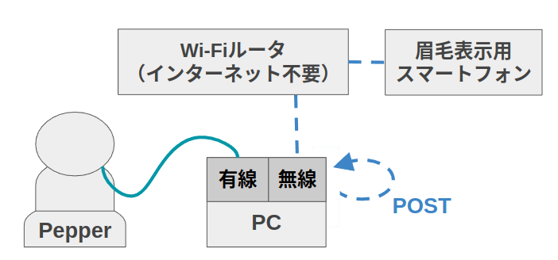

## ペッパーとこちさんのトークイベント

### 本ディレクトリの環境構築
1. 本ディレクトリをコピーし、以下のようなファイル構成にする
    ```
    -- miraikan_ws
       `-- src
           `-- miraikan_demo
    ```

2. ビルドする
    ```
    $ cd miraikan_ws
    $ catkin build miraikan_demo
    $ source ~/miraikan_ws/devel/setup.bash
    ```

### ペッパーとの接続・動作確認
0. Pepperのボタン操作<br>
    長押し▷電源ON,OFF<br>
    2回押し▷レストモードON, OFF<br>
    1回押し▷IPアドレス確認<br>

1. Pepperとの接続：初回設定
    1. PepperとPCを有線接続し、設定からIPV4メソッドをリンクローカルのみに設定する。Pepperと名前を付けて設定を保存しておく。<br>
        <br>
    2. [pynaoqi-python2.7-2.5.5.5-linux64](https://drive.google.com/file/d/1xHuYREDa78xGiikEpsjxfZQ7Gfvo1E9D/view)をダウンロードし、.bashrcに以下を追記する
        ```
        export PYTHONPATH=$HOME/Downloads/pynaoqi-python2.7-2.5.5.5-linux64/lib/python2.7/site-packages:$PYTHONPATH
        ```
2. Pepperの起動と接続<br>
    ディスプレイ下の電源ボタンを長押しして起動。起動したらもう一度軽く押す。するとPepperが自分のIPアドレス`<Pepper_IP>`を音声で教えてくれる。`talk_motion.py`15行目の`self.PEPPER_IP=`以降のIPアドレスを`<Pepper_IP>`で書き換える。また、以下コマンドでPATHを通す
    ```
    $ export NAO_IP="<Pepper_IP>"
    ```
3. `talk_motion.py`を実行してPepperが動いて喋ることを確認する<br>
    ```
    $ python
    >>> import talk_motion
    >>> talk = talk_motion.Talk()
    >>> talk.episode_11("<Pepper_IP>")
    ```

### 実行方法
1. 以下の図のようにネットワーク接続を行う。<br>
    <br>

2. PCの設定からネットワーク▷有線▷Pepperを選択する。Pepperの電源を入れてIPアドレス`<Pepper_IP>`を聞き取ったら以下を実行する
    ```
    $ export NAO_IP="<Pepper_IP>"
    ```
    詳細は[ペッパーとの接続・動作確認](#ペッパーとの接続・動作確認)参照

3. PC2で眉毛デバイスサーバーを立ち上げる。以降、PC2のIPアドレスを`<PC2_IP>`とする。
    ```
    $ cd ../web_nodejs
    $ docker-compose up
    ```
    ※眉毛デバイスサーバーのセットアップは[web_nodejs:初回設定](https://github.com/MiyabiTane/Deco_with_robot/tree/main/facial_expression/web_nodejs#%E5%88%9D%E5%9B%9E%E8%A8%AD%E5%AE%9A)を参照。<br>
    ※IPアドレスはターミナルに`$ifconfig`と打ち込んだ時の`wlp1s0:`下の`inet`以降の値`xxx.xxx.xxx.xxx`

3. スマートフォンを2台用意し、それぞれで左眉毛(http://<PC2_IP>:3000/lbrow)、右眉毛(http://<PC2_IP>:3000/rbrow)の画面を表示する。<br>
    ※ブラウザはGoogle Chrome推奨。ページが立ち上がったらアドレスバーを隠すよう、上にスワイプする。

4.  PC2にジョイスティックを接続して以下を実行
    ```
    $ export NAO_IP="<Pepper_IP>"
    $ source ~/miraikan_ws/devel/setup.bash
    $ roslaunch miraikan_demo lecture-demo.launch eyebrows_server_ip:="<PC2_IP>" pepper_ip:="<Pepper_IP>"
    ```
    ジョイスティックのボタンを押してPepperが話して動き、ブラウザ上の眉毛が動けばOK

5. `lecture-demo.launch`の引数詳細<br>
    `run_eyebrows_server` launchを立ち上げる際に眉毛デバイスサーバーを立ち上げるか否か<br>
    `eyebrows_server_ip` 眉毛デバイスのサーバーをたてているIPアドレス。run_eyebrows_serverがFalseの場合は指定が必要<br>
    `use_robot` 実機を繋いでいるか否か。繋いでいない場合は実機の動作の代わりにターミナルに経過秒数が表示される。<br>
    `pepper_ip` 実機のIPアドレス。use_robotがTrueの場合は指定が必要<br>
    `memories_talk` Trueの場合は思い出語りver, Falseの場合は発表形式verのデモが起動する。use_robotがFalseの場合には機能しない<br>
    ※`run_eyebrows_server:=True`を指定する場合は以下のようなファイル構想にしておく必要がある
    ```
    -- miraikan_ws
       `-- src
           |-- miraikan_demo
           `-- web_nodejs
               |-- src
               `--docker-compose.yml
    ```

### rosservice
1. /demo_mode
    ```
    subscribe: mode       ... int32: 実行するデモ（動き・喋り・眉毛）のモード
             : time_delay ... int32: デモを開始して何秒後に眉毛を動かし始めるか
    publish  : success    ... bool : service callの呼び出しに成功したか否か 
    ```
2. /demo_deai_1, /demo_deai_2
    ```
    Empty service
    ```

※コマンドから呼び出す例
```
$ rosservice call /episode_11 "{}"
$ rosservice call /demo_mode "mode: 1 time_delay: 5"
```

### [旧]ペッパーの動き・言葉のデモとの組み合わせ
[fake_motion_talk.py](https://github.com/MiyabiTane/Deco_with_robot/blob/main/facial_expression/miraikan_demo/scripts/fake_motion_talk.py)を@a-ichikuraの[talk_motion.py](https://github.com/a-ichikura/miraikan/blob/master/pepper_talk/talk_motion.py)で置き換える。この時、talk_motion.pyの`if __name__ == '__main__':`以下はコメントアウトする。
```
if __name__ == '__main__':
    talk = Talk()
    talk.episode_11()
    talk.episode_12()
    talk.episode_13()
```

### [旧]Pepperのイベントプログラムへの組み込み
※以下、@kochigamiの[interactive_robot_demo](https://gitlab.jsk.imi.i.u-tokyo.ac.jp/kochigami/interactive_robot_demo/-/blob/master/lecture_demo)と組み合わせる場合を例として説明する

1. lecture-demo.launchに以下を追加する
    ```
    <arg name="eyebrows_server_ip" default="localhost" />
    <arg name="run_eyebrows_server" default="false" />
    <arg name="use_robot" default="true" />

    <include file="$(find miraikan_demo)/launch/demo.launch">
        <arg name="eyebrows_server_ip" value="$(arg eyebrows_server_ip)"/>
        <arg name="run_eyebrows_server" value="$(arg run_eyebrows_server)" />
        <arg name="use_robot" value="$(arg use_robot)" />
    </include>
    ```

2. 本ディレクトリのdemo.lの名前をrobot-behaior-server.lに変更し、もとあるものと置き換える